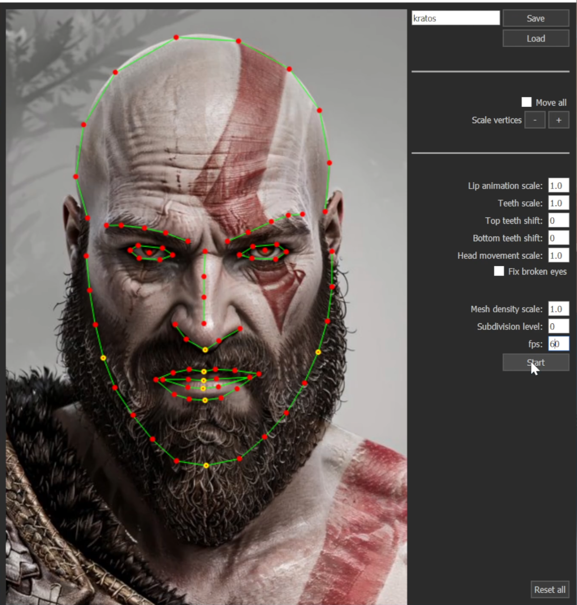

# Instant talking portrait

Simple, fast warp-based talking face from image and audio with no reference footage. Uses https://github.com/mikecokina/puppet-warp for image warping.

### Demo: 
https://www.youtube.com/watch/7d77oR1cpjY

### Description: 
This is my practice project to get some experience. The core of the project consists of three models: one for depth estimation and two others for modeling lip and head movement from spectrogram. Depth is a checkpoint of DepthAnything-v2, while the two other models were developed by me. Training data was extracted from a subset of AVSpeech processed with openpose. We model 25 lip keypoints + 1 head center displacement, with regression and diffusion respectively, in 30 fps. You can expect an inference time of about 0.2 second on mid-range cpu. The image is projected onto a mesh generated with keypoints, several morph targets are precomputed, and the models estimate temporal evolutions of their blending coefficients. The depth map is used to scale the displacement of vertices, creating the illusion of perspective, even though the camera is orthographic.
The application is built using PyQt5 with OpenGL. After all precomputations are done, it opens a socket server that processes real-time audio input.

### Installation:
1. Clone https://github.com/maximmashkov1/instant_talking_portrait
2. Install requirements.txt
3. Download depth_anything_v2_vitb.pth from https://huggingface.co/depth-anything/Depth-Anything-V2-Base/tree/main and place it inside Depth-Anything-V2/checkpoints
4. Start main.py

### Usage:
After defining a character, send audio to be pronounced as shown in example_send_message.py
